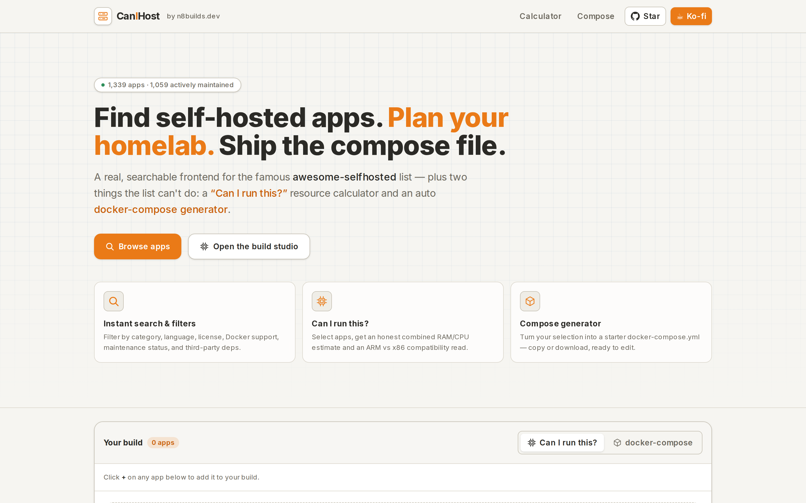
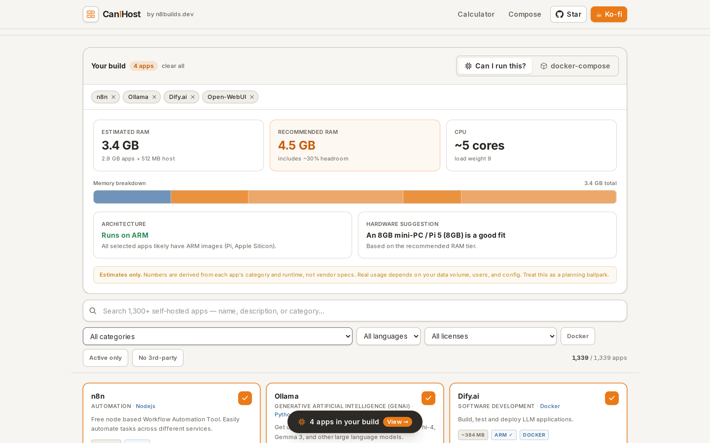
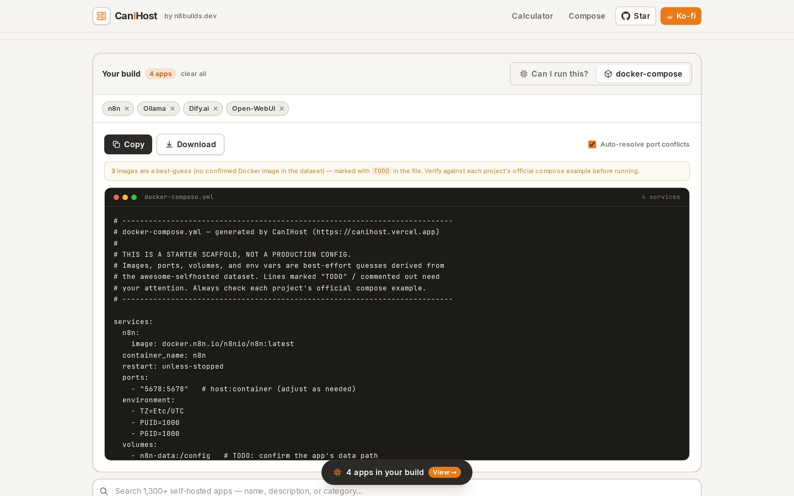

# CanIHost — search self-hosted apps, plan your homelab, generate docker-compose

**A real, searchable frontend for the famous [awesome-selfhosted](https://github.com/awesome-selfhosted/awesome-selfhosted) list — plus a "Can I run this?" resource calculator and an auto docker-compose generator the list can't give you.**

Browse 1,300+ self-hosted apps and selfhosted alternatives, check maintenance signals at a glance, estimate your homelab's combined RAM/CPU footprint, see ARM-vs-x86 compatibility, and export a starter `docker-compose.yml` — all free, open-source, and 100% client-side.

🌐 **Live: [canihost.vercel.app](https://canihost.vercel.app)** · ☕ [Support on Ko-fi](https://ko-fi.com/n8watkins)



## Why

[awesome-selfhosted](https://github.com/awesome-selfhosted/awesome-selfhosted) is one of the best community resources on the internet — but it's a README sorted into A→Z categories. You can't search it well, you can't tell which apps are still maintained, and it certainly won't tell you whether your Raspberry Pi can actually *run* the five things you just got excited about.

CanIHost fixes that with three things:

1. **A real frontend** — instant search and rich filters over the whole dataset.
2. **A resource calculator** — "Can I run this?" gives an honest combined RAM/CPU estimate and an ARM/x86 read for any set of apps you pick.
3. **A compose generator** — turn your selection into a starter `docker-compose.yml` you can copy or download.

## Features

- **Instant client-side search** over 1,300+ apps — name, description, category, language.
- **Filters** — category, language/platform, license, Docker support, "actively maintained only," and a "hide third-party-dependent apps" flag.
- **Maintenance signals on every card** — GitHub star count plus a recency badge (**Active** / **Aging** / **Stale**) derived from the last commit date, so you can avoid abandonware.
- **🧮 "Can I run this?" calculator** — select apps and get an estimated combined RAM footprint (with host overhead + headroom), a CPU load read, an ARM-vs-x86 compatibility view, and a relatable hardware suggestion ("a Pi 5 / 8GB mini-PC can handle this").
- **🐳 docker-compose generator** — generates a sensible starter `docker-compose.yml` with per-app service blocks (image, ports, volumes, env placeholders), auto-resolves host-port conflicts, and clearly marks every guess with `TODO`. Copy or download.
- **Keyboard-accessible**, responsive, animated, with skeletons and empty states. Light "blueprint / homelab" design.



## How it works

Everything is **static and build-time**: no database, no server, no tracking.

- **Data pipeline** (`scripts/build-data.mjs`) clones the structured [awesome-selfhosted-data](https://github.com/awesome-selfhosted/awesome-selfhosted-data) source (`software/*.yml`, `tags/*.yml`, `licenses.yml`) and bakes it into a single `data/apps.json`.
- **Maintenance signals** come straight from that dataset, which already carries `stargazers_count`, `updated_at`, and `commit_history` scraped from GitHub — so the site needs **zero** runtime API calls. The recency badge is computed from the last-commit date.
- **Resource estimates** are *honest, category-based heuristics* — derived from each app's primary category and language runtime, **not** vendor specs. They're labelled as estimates everywhere. The calculator adds a host-OS/Docker baseline and ~30% headroom.
- **ARM compatibility** is inferred from the app's runtime (compiled and interpreted runtimes are nearly all multi-arch today); anything uncertain is flagged, not faked.
- **Compose scaffolding** derives a plausible image (from a curated map of popular apps, falling back to a clearly-marked guess from the repo owner/name), a default port by category, and volume/database hints. Uncertain lines are commented or marked `TODO`.



## Development

```bash
npm install

# (re)generate data — clone the source first:
git clone --depth 1 https://github.com/awesome-selfhosted/awesome-selfhosted-data /tmp/awesome-selfhosted-data
npm run data

npm run dev      # → http://localhost:7681
npm run build    # production build
```

Next.js 15 (App Router) · React 19 · TypeScript · Tailwind CSS v4 · framer-motion. Hosts free on Vercel.

## Data & credit

All app data comes from **[awesome-selfhosted](https://github.com/awesome-selfhosted/awesome-selfhosted)** and its [structured dataset](https://github.com/awesome-selfhosted/awesome-selfhosted-data) — an incredible community resource maintained by hundreds of contributors. **[Go star it.](https://github.com/awesome-selfhosted/awesome-selfhosted)** CanIHost is an independent frontend; it doesn't replace the list, it makes it searchable and adds planning tools on top.

Resource numbers and ARM compatibility are **honest estimates**, not vendor specs — always verify against each project's own documentation.

## Support & more

- ⭐ **[Star CanIHost on GitHub](https://github.com/n8watkins/canihost)** — it genuinely helps.
- ☕ **[Support on Ko-fi](https://ko-fi.com/n8watkins)**

  [](https://ko-fi.com/n8watkins)
- 🛠 **Need something like this built?** [Appturnity](https://appturnity.com) ships polished web apps, internal tools, and custom software — [let's talk](https://appturnity.com).

## License

[MIT](./LICENSE) © 2026 Nathan Watkins · Built by [Nate · n8builds.dev](https://n8builds.dev)
